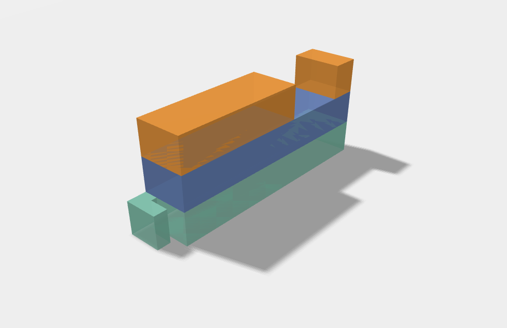

# Convertidor de archivos GeoJSON a visualizaciones ThreeJS

Esta librería permite transformar archivos GeoJSON en visualizaciones interactivas utilizando Three.js.

## Instrucciones de uso:

1. Instalación de dependencias:

   ```bash
   npm install
   ```

2. Ejecución en modo de desarrollo:

   ```bash
   npm run vite
   ```

3. Creación del build:
   ```bash
   npm run vite build
   ```

## Construcción (Build)

El resultado del proceso de construcción es una biblioteca JavaScript que contiene todos los elementos necesarios para ser implementada en cualquier entorno.

El proceso de implementación es sumamente sencillo y se explica a continuación:

```javascript
<script type="module">
  import LatbitGeojson from "./main.js"; new LatbitGeojson(0); // Cambia el valor de 0 por el ID del archivo GeoJSON que desees visualizar.
</script>
```

Este fragmento de código agrega un visualizador Three.js en el elemento `<body>`, lo que permite mostrar la visualización del archivo GeoJSON correspondiente al ID especificado. En el ejemplo, se usa el ID 0 para mostrar el archivo GeoJSON de prueba.

## Ejemplo



¡Explora y visualiza tus datos GeoJSON de manera interactiva con Three.js!
